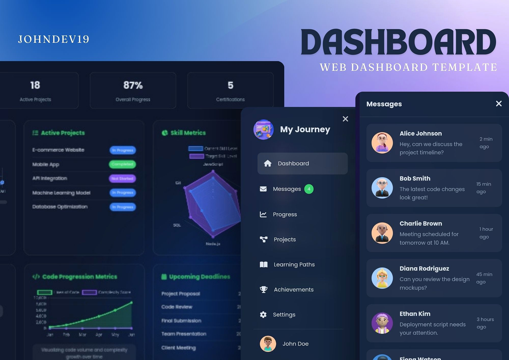
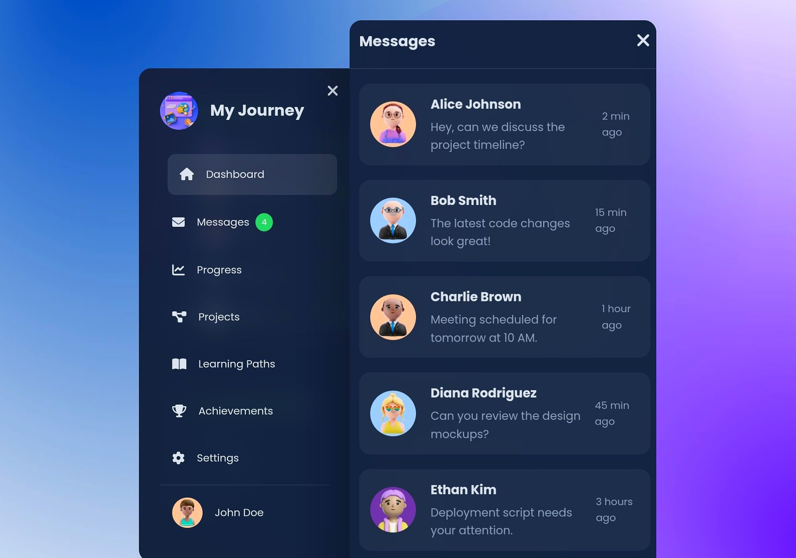
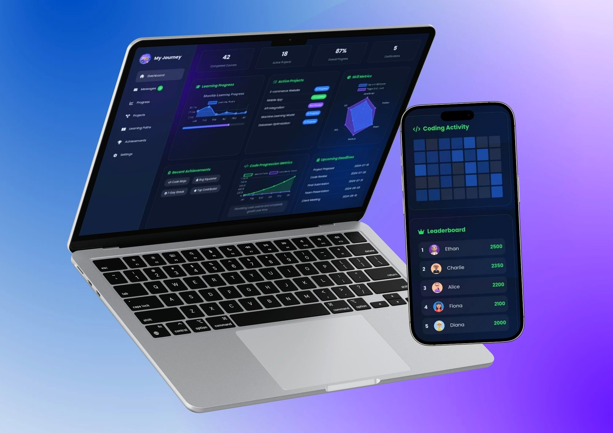

# Coding Journey Dashboard

**Coding Journey Dashboard**, is an interactive web template dashboard... to track, measure, and enhance your coding skills and project progress.





## Table of Contents
- [Features](#features)
- [Technologies Used](#technologies-used)
- [Setup Instructions](#setup-instructions)
- [Project Structure](#project-structure)
- [Contributing](#contributing)
- [License](#license)

---

## Features

### Dashboard Highlights
- **Quick Stats**: Data on completed courses, active projects, overall progress, and certifications.
- **Interactive Charts**: Dynamic graphs visualizing learning and skill metrics.
- **Project Management**: Track active projects and upcoming deadlines.
- **Achievements**: Showcase recent achievements and milestones.
- **Learning Paths**: Personalized recommendations for improving your skills.
- **Coding Activity Calendar**: Visualize your daily coding activity.

### Sidebar Navigation
- Key sections such as:
  - **Dashboard**
  - **Messages**
  - **Progress**
  - **Projects**
  - **Learning Paths**
  - **Achievements**
  - **Settings**

### Additional Features
- Notifications for important updates.
- Leaderboard to encourage friendly competition.
- Links to useful learning resources.

---

## Technologies Used

### Frontend
- **HTML5**: Markup structure.
- **CSS3**: Styling and layout (custom design via `styles.css`).
- **Font Awesome**: Icons for visual enhancement.
- **Google Fonts**: Typography (Poppins font).

### Libraries
- **Chart.js**: Interactive data visualizations.
- **AOS (Animate On Scroll)**: Smooth animations.

### Scripts
- **JavaScript**: Dynamic behavior and interactivity (`script.js`, `messages.js`).

---

## Project Structure

```plaintext
coding-journey-dashboard/
├── assets/
│   ├── images/
│   │   ├── header_logo.jpg
│   │   └── more_images...
├── styles.css
├── script.js
├── messages.js
├── index.html
```

---

## Contributing

We welcome contributions! To contribute:
1. Fork the repository.
2. Create a feature branch:
   ```bash
   git checkout -b feature-name
   ```
3. Commit your changes and push the branch.
4. Open a Pull Request.

---

## License

This project is licensed under the **MIT [LICENCE](LICENSE)**. Feel free to use and modify it for personal and commercial purposes.

---

Feel free to explore and learn this dashboard for your coding journey. Happy coding! 😊
